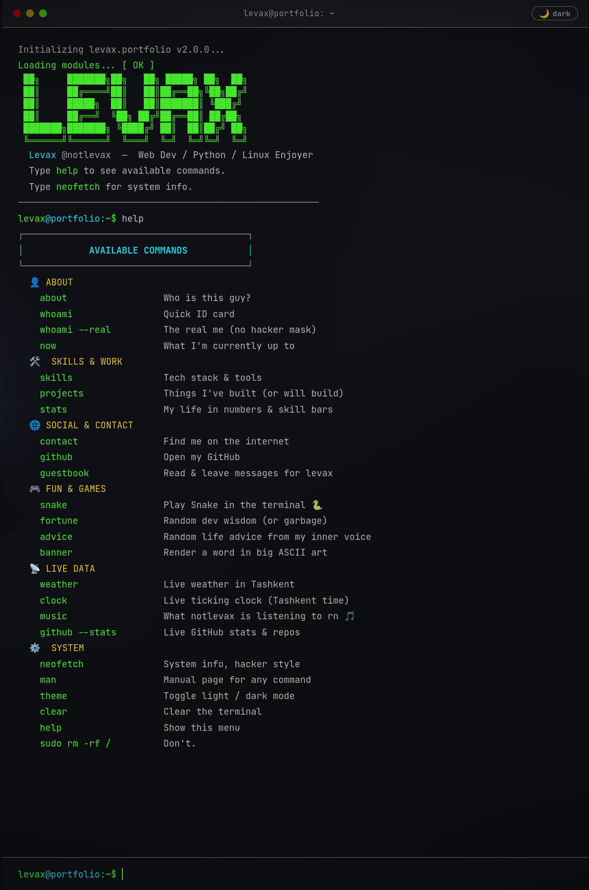

# levax@portfolio:~$ 🖥️

> A terminal/CLI-style portfolio built with vanilla HTML, CSS & JS.  
> No frameworks. No npm install. No cap.


<!-- ^ take a screenshot of your portfolio and drop it here as preview.png -->

---

## ✨ Features

- 🟢 Fake terminal that actually works
- ⌨️ Type commands to navigate — just like a real shell
- 🌙 / ☀️ Dark & light mode toggle (your eyes, your choice)
- 📜 Command history with arrow keys (↑ ↓)
- 💀 `sudo rm -rf /` easter egg (try it)
- 🖥️ `neofetch` because of course
- CRT scanlines & vignette for that retro hacker aesthetic
- Zero dependencies — just one `index.html` file

---

## 🚀 Live Demo

👉 **[notlevax.github.io/portfolio](https://notlevax.github.io/portfolio)**
<!-- update this link once you deploy -->

---

## 🛠️ Run Locally

No build step, no node_modules, no suffering.

```bash
git clone https://github.com/notlevax/portfolio.git
cd portfolio

# then just open index.html in your browser
# on Linux:
xdg-open index.html

# on Mac:
open index.html

# or just drag it into your browser. it works, trust.
```

---

## 🎨 How to Customize

Everything you need to change is inside the `DATA` object at the top of the `<script>` tag in `index.html`:

```js
const DATA = {
  name: 'Levax',           // your name
  handle: '@notlevax',     // your handle

  bio: [
    'line 1 of your bio',
    'line 2 of your bio',
  ],

  skills: {
    'Category': ['Skill1', 'Skill2'],  // add/remove categories freely
  },

  projects: [
    { name: 'My Project', desc: 'what it does', status: 'WIP' },
    // status can be: 'WIP', 'Done', 'Abandoned rip', whatever
  ],

  contact: [
    { label: 'Telegram', value: '@you', href: 'https://t.me/you' },
    { label: 'Discord',  value: '@you', href: null },  // null = no link
  ],
};
```

### Adding a new command

Find the `COMMANDS` object and add yours:

```js
const COMMANDS = {
  // ... existing commands ...

  mycommand() {
    blank();
    line('whatever you want to print here', 'ok');  // ok = green
    line('this one is yellow', 'warn');
    line('this one is red', 'err');
    line('this one is muted/gray', 'muted');
    blank();
  },
};
```

### Changing colors

Find `:root` in the `<style>` tag and go wild:

```css
:root {
  --green: #39ff14;   /* main accent color */
  --cyan:  #00e5ff;   /* secondary accent */
  --bg:    #0d0d0d;   /* background */
  /* etc */
}
```

---

## 🗂️ File Structure

```
portfolio/
└── index.html    # the whole thing lives here lol
└── preview.png   # screenshot for this README (add this yourself)
└── README.md     # you're reading it
```

---

## 📦 Deploy on GitHub Pages

1. Push `index.html` to your repo
2. Go to **Settings → Pages**
3. Source: `Deploy from branch` → `main` → `/ (root)`
4. Save → wait ~30 seconds → profit 🎉

---

## 📄 License

Do whatever you want with it. Just don't pretend you're me. — *Levax*
