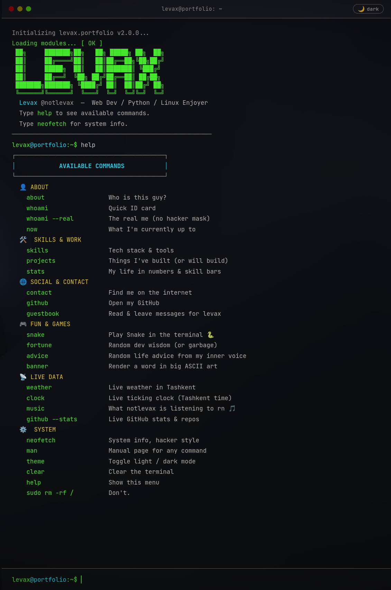

# levax@portfolio:~$ 🖥️

> A terminal/CLI-style portfolio built with vanilla HTML, CSS & JS.  
> No frameworks. No npm install. No cap.


<!-- ^ take a screenshot of your portfolio and drop it here as preview.png -->

---

## ✨ Features

- 🟢 Fake terminal that actually works
- ⌨️ Type commands to navigate — just like a real shell
- 🌙 / ☀️ Dark & light mode toggle (your eyes, your choice)
- 📜 Command history with arrow keys (↑ ↓)
- 🐍 Playable Snake game in the terminal
- 🎵 Live music via Last.fm API
- 📡 Live weather & GitHub stats
- 📖 Guestbook — visitors can leave messages
- 💀 Hidden easter eggs (find them yourself)
- 🖥️ `neofetch` because of course
- CRT scanlines & vignette for that retro hacker aesthetic
- Zero dependencies — just one `index.html` file

---

## 🚀 Live Demo

👉 **[levaxgit.github.io/CLI-Portfolio/](https://levaxgit.github.io/CLI-Portfolio/)**

---

## 🕹️ Commands

### 👤 About
| Command | Description |
|---|---|
| `about` | Who is this guy? |
| `whoami` | Quick ID card |
| `whoami --real` | The real me (no hacker mask) |
| `now` | What I'm currently up to |

### 🛠️ Skills & Work
| Command | Description |
|---|---|
| `skills` | Tech stack & tools |
| `projects` | Things I've built (or will build) |
| `stats` | My life in numbers & skill bars |

### 🌐 Social & Contact
| Command | Description |
|---|---|
| `contact` | Find me on the internet |
| `github` | Open my GitHub (auto-opens) |
| `guestbook` | Read messages from visitors |
| `guestbook add <n> \| <msg>` | Leave a message |

### 📡 Live Data
| Command | Description |
|---|---|
| `weather` | Live weather in Tashkent |
| `clock` | Live ticking clock (Tashkent time) |
| `music` | What notlevax is listening to rn |
| `github stats` | Live GitHub stats & repos |

### 🎮 Fun & Games
| Command | Description |
|---|---|
| `snake` | Playable Snake — arrow keys to move, Q to quit |
| `banner <word>` | Render a word in big ASCII art |
| `fortune` | Random dev wisdom (or garbage) |
| `advice` | Random life advice from my inner voice |

### ⚙️ System
| Command | Description |
|---|---|
| `neofetch` | System info, hacker style |
| `man <command>` | Manual page for any command |
| `theme` | Toggle light / dark mode |
| `clear` | Clear the terminal |
| `help` | Show all commands |

> 💡 There are also some hidden commands. Find them yourself. 👀

---

## 🛠️ Run Locally

No build step, no node_modules, no suffering.

```bash
git clone https://github.com/LevaxGit/CLI-Portfolio.git
cd CLI-Portfolio

# then just open index.html in your browser
# on Linux:
xdg-open index.html

# on Mac:
open index.html

# or just drag it into your browser. it works, trust.
```

---

## 🎨 How to Customize

Everything you need to change is inside the `DATA` object at the top of the `<script>` tag in `index.html`:

```js
const DATA = {
  name: 'Levax',           // your name
  handle: '@notlevax',     // your handle

  bio: [
    'line 1 of your bio',
    'line 2 of your bio',
  ],

  skills: {
    'Category': ['Skill1', 'Skill2'],  // add/remove categories freely
  },

  projects: [
    { name: 'My Project', desc: 'what it does', status: 'WIP' },
    // status can be: 'WIP', 'Done', 'Abandoned rip', whatever
  ],

  contact: [
    { label: 'Telegram', value: '@you', href: 'https://t.me/you' },
    { label: 'Discord',  value: '@you', href: null },  // null = no link
  ],
};
```

### Adding a new command

Find the `COMMANDS` object and add yours:

```js
const COMMANDS = {
  // ... existing commands ...

  mycommand() {
    blank();
    line('whatever you want to print here', 'ok');  // ok = green
    line('this one is yellow', 'warn');
    line('this one is red', 'err');
    line('this one is muted/gray', 'muted');
    blank();
  },
};
```

### Updating the `now` command

Find the `now()` function and edit the lines — this is meant to be updated regularly as you work on new things:

```js
now() {
  line('  Currently building: your project here');
  line('  Currently learning: something cool');
}
```

### Changing colors

Find `:root` in the `<style>` tag and go wild:

```css
:root {
  --green: #39ff14;   /* main accent color */
  --cyan:  #00e5ff;   /* secondary accent */
  --bg:    #0d0d0d;   /* background */
  /* etc */
}
```

---

## 🗂️ File Structure

```
CLI-Portfolio/
├── index.html    # the whole thing lives here lol
├── preview.png   # screenshot for this README (add this yourself)
└── README.md     # you're reading it
```

---

## 📦 Deploy on GitHub Pages

1. Push `index.html` to your repo
2. Go to **Settings → Pages**
3. Source: `Deploy from branch` → `main` → `/ (root)`
4. Save → wait ~30 seconds → profit 🎉

---

## 📝 Changelog

### v2.0.0
- 🐍 Added playable Snake game
- 📖 Added Guestbook (powered by JSONBin.io)
- 🎵 Added live music via Last.fm API
- 📡 Added live weather (open-meteo.com)
- 🕐 Added live clock (Tashkent timezone)
- 📊 Added live GitHub stats
- 💡 Added `advice` command
- 📊 Added `stats` command with skill bars
- 🔤 Added `banner <word>` ASCII art generator
- 📖 Added `man <command>` manual pages
- 🌙 Added dark/light mode toggle
- 🕹️ Added Konami code easter egg
- 🗂️ Categorized `help` command

### v1.0.0
- 🚀 Initial release
- Basic commands: `about`, `skills`, `projects`, `contact`, `whoami`, `neofetch`, `fortune`
- CRT scanlines & vignette effect

---

## 📄 License

Do whatever you want with it. Just don't pretend you're me. — *Levax*
